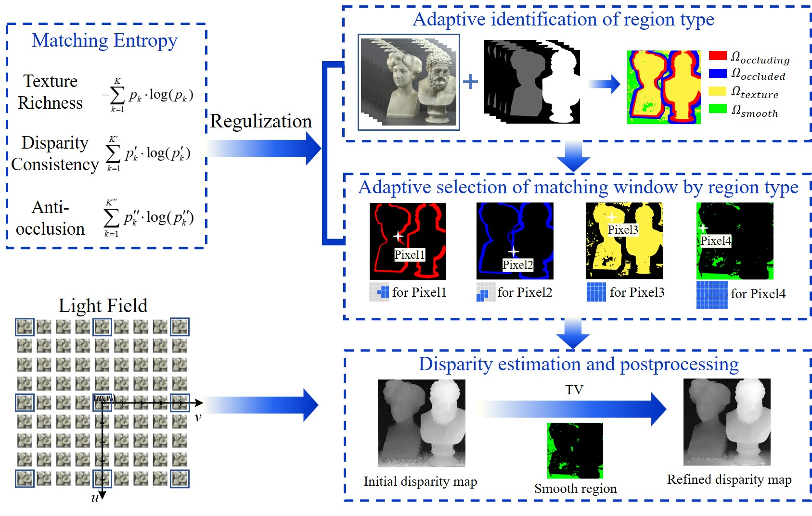

# Matching-Entropy-based-Disparity-Estimation-from-Light-Field

## abstract
A major challenge for matching-based disparity estimation from light field data is to prevent mismatches in occlusion and smooth regions. An effective matching window satisfying three characteristics: texture richness, disparity consistency, and anti-occlusion should be able to prevent mismatches to some extent. According to these characteristics, we propose matching entropy in the spatial domain of the light field to measure the amount of correct information in a matching window, which provides the criterion for matching window selection. Based on matching entropy regularization, we establish an optimization model for disparity estimation with a matching cost fidelity term. To find the optimum, we propose a two-step adaptive matching algorithm. First, the region type is adaptively determined to identify occluding, occluded, smooth, and textured regions. Then, the matching entropy criterion is used to adaptively select the size and shape of matching windows, as well as the visible viewpoints. The two-step process can reduce mismatches and redundant calculations by selecting effective matching windows. The experimental results on synthetic and real data show that the proposed method can effectively improve the accuracy of disparity estimation in occlusion and smooth regions and has strong robustness for different noise levels. Therefore, high-precision disparity estimation from 4D light field data is achieved.
## Schematic diagram 


## Citation
````
@article{Shi:23,
author = {Ligen Shi and Chang Liu and Di He and Xing Zhao and Jun Qiu},
journal = {Opt. Express},
keywords = {Image processing; Imaging systems; Integral photography; Light fields; Plenoptic imaging; Three dimensional image processing},
number = {4},
pages = {6111--6131},
publisher = {Optica Publishing Group},
title = {Matching entropy based disparity estimation from light field data},
volume = {31},
month = {Feb},
year = {2023},
url = {https://opg.optica.org/oe/abstract.cfm?URI=oe-31-4-6111},
doi = {10.1364/OE.479741},
}
````
